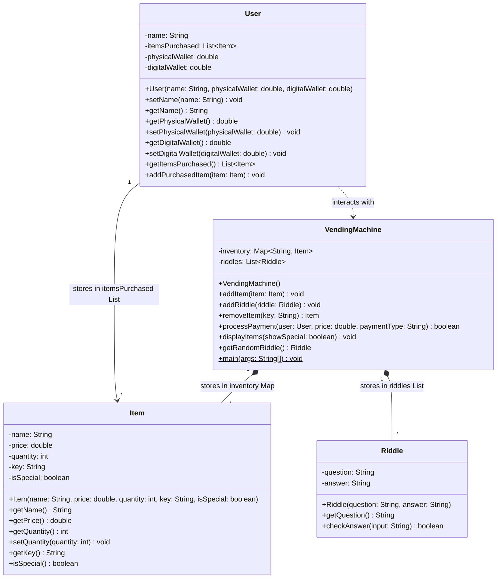

# cs2114-project1-group33
# The Riddler Machine - CS 2114 Project 1

## Overview
The Riddler Machine is an interactive, console-based vending machine simulation written in Java. This system features a twist, where users can trigger riddle challenges to unlock a hidden catalog of special items.

## Features
* **Dynamic Inventory System:** Item stock quantities are randomized at the start of each session.
* **Dual Wallet Payment:** Users can pay using standard Cash (Physical Wallet) or Card (Digital Wallet).
* **Secret Menu:** A certain probability to trigger a riddle on purchase attempts. Answering correctly unlocks exclusive items.
* **Input Handling:** Sanitizes user inputs for spacing and capitalization, gracefully catching invalid selection codes and out-of-stock errors without crashing.

## File Structure
* `src/vending/`
  * `VendingMachine.java`: The core controller managing inventory, menus, and the transaction loop.
  * `Item.java`: Defines the properties of vending items (price, stock, VIP status, item key).
  * `User.java`: Manages the user's identity, physical/digital balances, and a list of purchased items.
  * `Riddle.java`: Stores questions and answers, and handles case-insensitive answer validation.
  * `VendingMachineTest.java`: Test class for VendingMachine.java
  * `ItemTest.java`: Test class for Item.java
  * `UserTest.java`: Test class for User.java
  * `RiddleTest.java`: Test class for Riddle.java

## How to Run
### Using Eclipse or VS Code
1. Open the project folder (`Project_1`) in your preferred IDE.
2. Navigate to `src/vending/VendingMachine.java`.
3. Click the **Run** button to start the interactive console.
4. Follow the on-screen prompts to view the menu, answer riddles, and purchase items.

# The Riddler Machine

A vending machine simulation with users, snacks, and riddles.

## Class Diagram

## How to Run

Run `VendingMachine.main()` to start the simulation.

